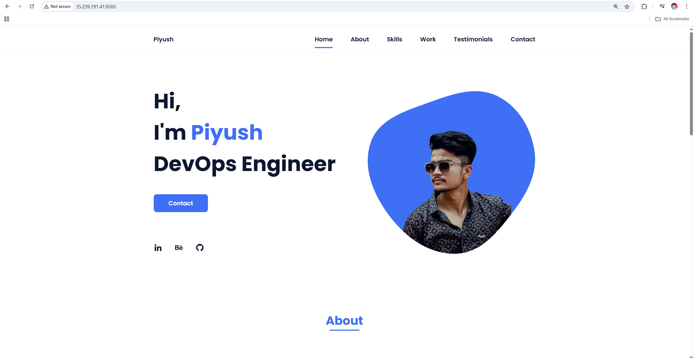
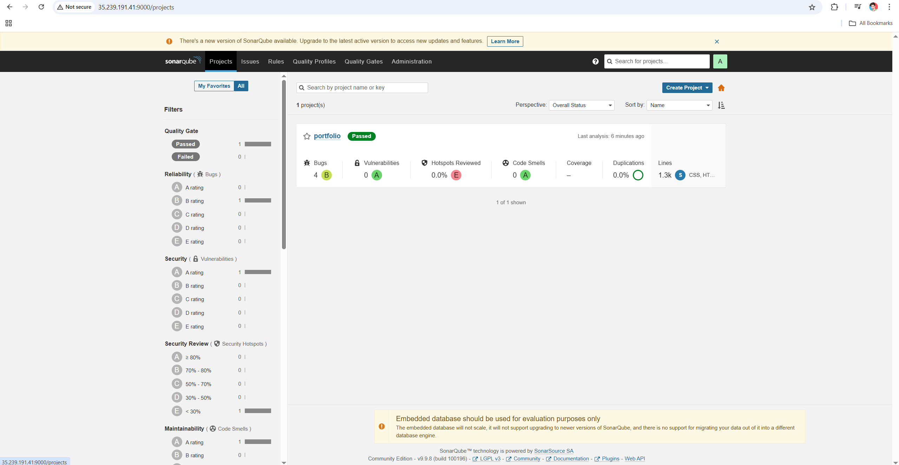
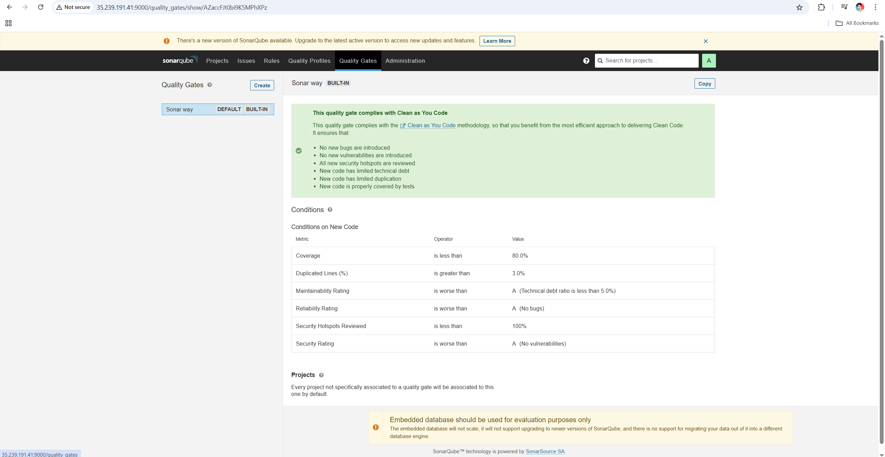
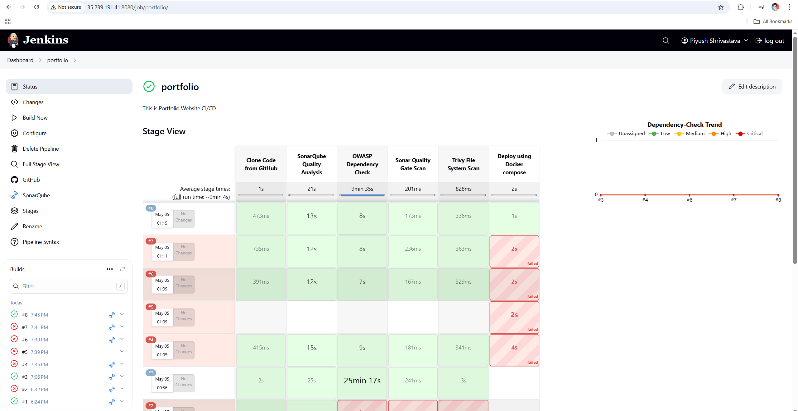

# 💼 Piyush's DevOps Portfolio Website

This is a portfolio website for **Piyush**, a DevOps Engineer, built to showcase professional skills, projects, and contact information. The project is automated using Jenkins with a full CI pipeline including code quality, security scanning, and Dockerized deployment.

---

## 🖥️ Website Preview

---

## 🛠️ Technologies Used

- HTML, CSS, JavaScript – Frontend structure and styling  
- Docker & Docker Compose – Containerized deployment  
- Jenkins – CI/CD pipeline automation  
- SonarQube – Code quality analysis  
- OWASP Dependency Check – Security vulnerability scan  
- Trivy – File system and image vulnerability scan  
- GitHub – Source code management

---

## 🧪 Jenkins CI Pipeline Overview

The Jenkins pipeline automates the following stages:

### 1. Clone Code from GitHub  
Pulls the latest code from the main branch.

### 2. SonarQube Quality Analysis  
Performs static code analysis using SonarQube.

### 3. OWASP Dependency Check  
Scans project dependencies for known vulnerabilities.

### 4. Sonar Quality Gate Scan  
Waits for SonarQube quality gate result (pass/fail).

### 5. Trivy File System Scan  
Scans the project directory using Trivy and generates an HTML report.

### 6. Deploy using Docker Compose  
Builds and runs the portfolio using Docker Compose.  
Successful builds result in a live deployment.

#### 🔧 CI/CD Pipeline Snapshot

---

